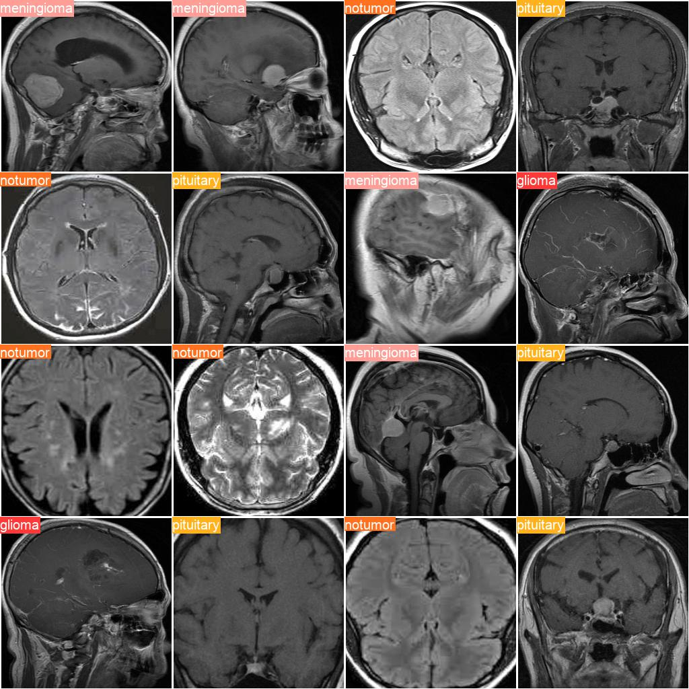

# 🧠 Brain Tumor Classification using YOLOv8

This project leverages YOLOv8 for classifying brain tumors from MRI images. It includes preprocessing steps, prediction with a trained model, and evaluation of performance metrics like precision, recall, and F1-score.

---

## 📁 Project Structure

```
├── Brain Tumor YOLOv8.py          # Possibly training or setup script for YOLOv8 (not shown)
├── PredictorCode.py               # Performs image preprocessing and prediction on a single image
├── PreprocessingCrop.py          # Contains reusable function to crop the tumor region from an image
├── ResultMetrics.py              # Batch evaluation on a test dataset with metric calculations
├── README.md                     # Project documentation
```

---

## 🚀 Getting Started

### 1. Clone the Repository

```bash
git clone https://github.com/<your-username>/brain-tumor-yolov8.git
cd brain-tumor-yolov8
```

### 2. Install Dependencies

Ensure you have the following packages installed:

```bash
pip install ultralytics opencv-python tqdm scikit-learn torchvision matplotlib
```

---

## 🧠 Model

A custom-trained YOLOv8 classification model is used:

```python
model = YOLO("path/to/weights/best.pt")
```

You can train your model using [Ultralytics YOLOv8](https://docs.ultralytics.com).

---

## 🖼️ Preprocessing

Tumor regions are cropped using `crop_img(img)` in `PreprocessingCrop.py`:

- Converts image to grayscale
- Applies Gaussian blur and binary threshold
- Detects contours and crops the region surrounding the tumor

---

## 🔍 Inference

To predict the class of a tumor in a single image:

```bash
python PredictorCode.py
```

This loads the model, processes a test image (`glinew.jpg`), and makes a prediction.

---

## 📊 Evaluation

Evaluate model performance on a test dataset:

```bash
python ResultMetrics.py
```

- Loads images from a test folder
- Applies resize and tensor transformation
- Computes `Precision`, `Recall`, and `F1-Score` using sklearn
- Prints classification report

---

## 📁 Dataset

Images should be organized for evaluation like so:

```
dataset/
└── class_1/
    ├── image1.jpg
    ├── image2.jpg
└── class_2/
    ├── image3.jpg
    ├── image4.jpg
...
```

Update the dataset path in `ResultMetrics.py` accordingly:

```python
dataset_path = "path/to/cleaned/test"
```

---

## 📷 Sample Outputs

Here are some sample predictions and visualizations :
- Labels of 16 Images:

- Predictions by model for the corresponding Images:


---

## 📌 Notes

- Model must be trained as a **YOLOv8 classification** model.
- `crop_img()` assumes the tumor is the most prominent blob in the image.
- You can expand this to detection tasks with bounding boxes by switching to YOLOv8 detection mode.

---

## 🤝 Contributions

Feel free to open issues or submit PRs for enhancements or bug fixes.

---

## 📜 License

This project is licensed under the MIT License. See the `LICENSE` file for details.
